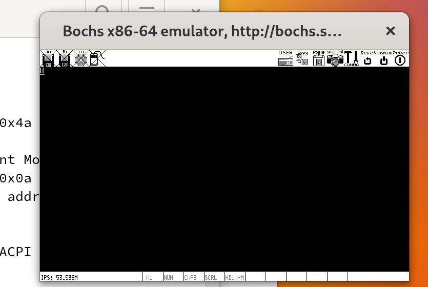

# 配置开发环境

## 安装软件包

- `sudo pacman -S nasm`：安装汇编编译器
- `sudo pacman -S bochs`：安装操作系统调试器

### 安装bochs
由于先安装archlinuxcn源，在archlinuxcn里下载bochs
博客1：https://www.cnblogs.com/zhanshenli/p/18106106：
- 安装archlinuxcn源
  - `sudo vim /etc/pacman.conf`
  - 写入：`[archlinuxcn]
    Server = https://mirrors.tuna.tsinghua.edu.cn/archlinuxcn/$arch`
- `pacman -S archlinuxcn-keyring`
- `pacman -Sy`

博客2：（杀千刀的密钥问题）https://www.bilibili.com/read/cv20753052/

必须要在`/etc/pacman.conf`加上一行`SigLevel = Optional TrustAll`才能正常使用。
如果你也在配置完成后无法使用，不妨将 pacman.conf 中添加的内容改为如下：

```
[archlinuxcn]
SigLevel = Optional TrustAll
Server = https://mirrors.tuna.tsinghua.edu.cn/archlinuxcn/$arch
```
之后尝试重新安装 `archlinux-keyring` 和 `archlinuxcn-keyring` 两个软件包，安装完毕后删除 `SigLevel = Optional TrustAll` 再尝试安装 CN 源内其他软件包。


## 写boot.asm

编译命令：`nasm -f bin boot.asm -o boot.bin`

## 创建硬盘镜像

创建硬盘镜像

`bximage -q -hd=16 -func=create -sectsize=512 -imgmode=flat master.img`

将boot.bin写入主引导扇区

`dd  if=boot.bin of=master.img bs=512 count=1 conv=notrunc`

## 配置bochs

- 在`onix/src`下，命令行输入`bochs -q`进入bochs页面
- 选择4，再输入文件名称`bochsrc`，输入7退出bochs页面
- 得到`bochsrc`文件
- 将`ata0-master: type=disk, path="master.img", mode=flat`替换`bochsrc`里的同名处
- 在`display_library: x,`后加上` options="gui_debug"`

`bochsrc`内容如下：
```ini
# configuration file generated by Bochs
plugin_ctrl: unmapped=true, biosdev=true, speaker=true, extfpuirq=true, parallel=true, serial=true, iodebug=true, pcidev=false, usb_uhci=false
config_interface: textconfig
display_library: x, options="gui_debug"
memory: guest=32, host=32, block_size=128
romimage: file="/usr/share/bochs/BIOS-bochs-latest", address=0x00000000, options=none, flash_data=none
vgaromimage: file="/usr/share/bochs/VGABIOS-lgpl-latest"
boot: disk
floppy_bootsig_check: disabled=0
floppya: type=1_44
# no floppyb
ata0: enabled=true, ioaddr1=0x1f0, ioaddr2=0x3f0, irq=14
ata0-master: type=disk, path="master.img", mode=flat
ata0-slave: type=none
ata1: enabled=true, ioaddr1=0x170, ioaddr2=0x370, irq=15
ata1-master: type=none
ata1-slave: type=none
ata2: enabled=false
ata3: enabled=false
optromimage1: file=none
optromimage2: file=none
optromimage3: file=none
optromimage4: file=none
optramimage1: file=none
optramimage2: file=none
optramimage3: file=none
optramimage4: file=none
pci: enabled=1, chipset=i440fx, slot1=none, slot2=none, slot3=none, slot4=none, slot5=none
vga: extension=vbe, update_freq=10, realtime=1, ddc=builtin
cpu: count=1:1:1, ips=4000000, quantum=16, model=bx_generic, reset_on_triple_fault=1, cpuid_limit_winnt=0, ignore_bad_msrs=1, mwait_is_nop=0
cpuid: level=6, stepping=3, model=3, family=6, vendor_string="AuthenticAMD", brand_string="AMD Athlon(tm) processor"
cpuid: mmx=true, apic=xapic, simd=sse2, sse4a=false, misaligned_sse=false, sep=true
cpuid: movbe=false, adx=false, aes=false, sha=false, xsave=false, xsaveopt=false, avx_f16c=false
cpuid: avx_fma=false, bmi=0, xop=false, fma4=false, tbm=false, x86_64=true, 1g_pages=false
cpuid: pcid=false, fsgsbase=false, smep=false, smap=false, mwait=true
print_timestamps: enabled=0
debugger_log: -
magic_break: enabled=1 0x0
port_e9_hack: enabled=false, all_rings=false
iodebug: all_rings=0
private_colormap: enabled=0
clock: sync=none, time0=local, rtc_sync=0
# no cmosimage
log: -
logprefix: %t%e%d
debug: action=ignore
info: action=report
error: action=report
panic: action=ask
keyboard: type=mf, serial_delay=150, paste_delay=100000, user_shortcut=none
mouse: type=ps2, enabled=false, toggle=ctrl+mbutton
speaker: enabled=true, mode=system
parport1: enabled=true, file=none
parport2: enabled=false
com1: enabled=true, mode=null
com2: enabled=false
com3: enabled=false
com4: enabled=false
```

## bochs调试
- `bochs -q`
- `continue`

